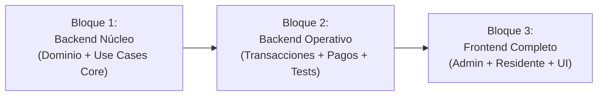

# Nexia — Metodología y Arquitectura de Prompts (Prompt Orchestrator)

Este documento define la metodología, taxonomía y estándares inmutables para la **generación de prompts arquitecturados** en el proyecto **Nexia**. 

Esta sesión de Antigravity actúa como el **Centro de Orquestación y Arquitectura de Prompts**. En este espacio se diseñan, refinan y estructuran los prompts con aislamiento arquitectónico que serán enviados a las sesiones de ejecución donde operan modelos de razonamiento denso como **Gemini 3.8 Flash (High)**, **Claude Sonnet 3.5 / 3.7 / 5.5** y **Claude Opus**.

---

## 1. Filosofía de Diseño: Prompt Chaining con Aislamiento Arquitectónico

Los modelos LLM de razonamiento avanzado y alta densidad lógica son excepcionalmente capaces al programar, pero en contextos amplios y tareas complejas tienden a sufrir tres sesgos naturales si no se delimitan rigurosamente:

1. **Scope Creep (Abarcar de más):** Ante directivas amplias (ej. *"haz el módulo de finanzas"*), intentan abarcar la base de datos, los controladores, servicios y pantallas a la vez. El resultado es código incompleto (`// TODO`), contratos rotos y desorden.
2. **Degradación Arquitectónica:** Si no se imponen las fronteras de Clean Architecture en cada capa, acoplan Prisma directamente en los controladores de Express o incluso en componentes de Next.js.
3. **Plano visual por defecto (UI genérica):** En frontend, ante peticiones abstractas recurren a interfaces planas sin jerarquía visual. Requieren directivas estructurales exactas (árbol de componentes, tokens Tailwind, elevaciones y variantes de diseño).

### La Regla Inmutable de los 3 Bloques por Fase

Para garantizar estabilidad y control atómico de commits, **toda fase de desarrollo se divide estrictamente en 3 bloques secuenciales**:



* **Bloque 1: Backend Núcleo:** Capa de Dominio (entidades, errores tipados, interfaces `IRepository`), DTOs Zod, Use Cases principales de negocio y servicios base.
* **Bloque 2: Backend Operativo / Transaccional / Auditoría:** Casos de uso secundarios, transacciones atómicas (`Prisma.$transaction`), lógica de persistencia, endpoints REST con RBAC y suite de pruebas unitarias con Vitest.
* **Bloque 3: Frontend (Next.js / shadcn):** Vistas de usuario (Admin, Residente, Guardia), formularios controlados con `react-hook-form` + Zod, diálogo modal y toasts (Sonner), integración HTTP con manejo de errores y microinteracciones.

---

## 2. El Blueprint Maestro (Estructura de 7 Secciones)

Cada prompt generado debe seguir religiosamente esta estructura de 7 secciones:

### Estructura de Secciones:

```markdown
### 1. ANCLAJE DE CONTEXTO Y ESTADO
- Confirmación explícita de la fase/bloque anterior completado y commiteado en `main`.
- Obligación de lectura de archivos de gobierno: `PROJECT_RULES.md`, `PROGRESS.md`, `implementation_plan.md`.
- Indicación clara del BLOQUE ACTIVO de la fase.

### 2. PROTOCOLO GIT FLOW (Instrucción de Shell)
- Verificación de estar en `main` limpio y actualizado.
- Comando para crear y cambiar a la rama de la tarea:
  `git checkout -b feat/fase-X-<nombre-modulo>-<backend/ui>`

### 3. ALCANCE TÉCNICO EXCLUSIVO (Capa por Capa)
[Para Backend - Clean Architecture]:
- Capa de Dominio: Contratos/interfaces (`IRepository`), errores tipados de negocio.
- Capa de Aplicación: DTOs con Zod, nombres exactos de `*UseCase` con validaciones de negocio.
- Capa de Infraestructura: Repositorios Prisma (con aislamiento forzoso `where: { condominio_id }`), transacciones ACID `Prisma.$transaction`, manejo monetario con `Decimal` (decimal.js).
- Capa de Presentación: Controllers, middlewares (Auth, RBAC, Tenant scoping) y rutas REST documentadas con método y URI.

[Para Frontend - Next.js / shadcn]:
- Rutas específicas en `apps/web/src/app/...`.
- Formularios: `react-hook-form` + resolvers Zod.
- Directivas visuales de diseño: Layout shell (`max-w-7xl mx-auto p-6 md:p-8`), cards blancas (`bg-white border-zinc-200 shadow-sm rounded-xl`), fondos `bg-zinc-50`, sin `alert()` o `confirm()` nativos (usar Shadcn Dialog y Toasts Sonner).
- Conexión a API (`src/lib/api.ts`).

### 4. REGLAS NEGATIVAS ESTRICTAS (Lo que NO debe hacer)
- "NO toques apps/web todavía" (si es fase backend).
- "NO implementes lógica del bloque siguiente".
- "PROHIBIDO ejecutar git commit por tu cuenta".

### 5. PUERTAS DE CALIDAD (QA Verification)
- Ejecución obligatoria de `npm run type-check` en todo el monorepo (0 errores).
- Tests unitarios con Vitest (`npm test`).
- Actualización obligatoria de `PROGRESS.md` marcando con `[x]` exclusivamente las tareas concluidas.

### 6. CRITERIOS DE ENTREGA Y HANDOFF MANUAL
- Resumen técnico conciso de lo realizado.
- Comando sugerido de commit en inglés bajo Conventional Commits para ejecución manual del desarrollador:
  `git commit -m "feat(<scope>): <description>"`
```

---

## 3. Reglas Técnicas Específicas de Nexia

Al redactar prompts para los modelos ejecutores, se deben incorporar obligatoriamente las siguientes restricciones operativas del proyecto:

### A. Nombres exactos de clases, métodos y esquemas
Nunca dejar a discreción del LLM los nombres de archivos o esquemas. Especificar:
- Nombre del DTO / Schema Zod (ej. `EmitFeeBatchSchema`).
- Nombre del Caso de Uso (ej. `EmitFeesUseCase`).
- Nombre de la interfaz de repositorio (ej. `IFeeRepository`).

### B. Aislamiento Multi-Tenant Estricto
Toda consulta o mutación en la capa de infraestructura Prisma debe incluir el filtro tenant:
```typescript
where: {
  id,
  condominio_id, // Obligatorio en toda consulta sensible
}
```

### C. Precisión Financiera y Transaccionalidad (Fase 4+)
- **Cero floats de JS:** Usar tipos `Decimal` de Prisma y la librería `decimal.js` (o manejo en centavos enteros) para importes, saldos y recargos.
- **Transacciones Atómicas:** Operaciones compuestas (ej. aprobar pago + cambiar estado de cuota + saldo) deben agruparse en `prisma.$transaction(async (tx) => { ... })`.

### D. Interfaz de Usuario y Experiencia (Frontend)
- Sin alertas ni confirms nativos (`alert()`, `confirm()` prohibidos por `PROJECT_RULES.md`). Utilizar `Dialog` de shadcn/ui y notificaciones Toast con `sonner`.
- Jerarquía visual sobria: cards blancas elevadas sobre fondo `bg-zinc-50`, bordes sutiles `border-zinc-200`, badges de estado semánticos (`default`, `secondary`, `destructive`, `outline`).

### E. Gestión de Ventana de Contexto en Sesiones Ejecutoras
- **Misma sesión/chat:** Mantener el chat abierto entre los bloques 1, 2 y 3 de una misma fase para que el modelo conserve el contexto fresco de los DTOs y tipos de TypeScript recién generados.
- **Nueva sesión/chat:** Al finalizar una fase completa (después de merge a `main` y validación de árbol limpio), se debe iniciar un chat nuevo para la siguiente fase.

---

## 4. Estado Actual del Proyecto y Hoja de Ruta

A la fecha, el avance registrado en `PROGRESS.md` es el siguiente:

- [x] **Fase 0:** Infraestructura y Scaffolding (11/11 completadas)
- [x] **Fase 1:** Autenticación, Tenants y Modelo Base (11/11 completadas)
- [x] **Fase 2:** Propiedades, Residentes, Vehículos y Marbetes (10/10 completadas)
- [x] **Fase 3:** Garita, Pases QR, Alertas Delivery y Fallback (19/19 completadas)
- [ ] **Fase 4: Módulo Financiero (Siguiente Fase Activa)** (0/11 completadas)
- [ ] **Fase 5:** Módulo de Amenidades (0/6 completadas)
- [ ] **Fase 6:** Notificaciones, Pulido y Documentación (0/8 completadas)
- [ ] **Fase 7:** Despliegue, Demo y Portafolio (0/8 completadas)

---

## 5. Mapeo de Bloques para la Fase 4 (Módulo Financiero)

La **Fase 4** consta de 11 tareas críticas en `PROGRESS.md`, articuladas en los siguientes 3 bloques de ejecución:

| Bloque | Enfoque | Casos de Uso y Componentes Clave |
| :--- | :--- | :--- |
| **Bloque 1** | **Backend Core Financiero** | `EmitFeesUseCase` (individual y masiva con `monto_cuota_base`), cálculo automático de recargos por mora (`recargo_mora_porcentaje`), consulta agregada de semáforo de morosidad (`al día`, `1 mes`, `moroso 2+ meses`), contratos `IFeeRepository`. Tipos `Decimal`. |
| **Bloque 2** | **Backend Pagos, Conciliación y Auditoría** | `SubmitPaymentUseCase` (comprobante bancario y referencia), `ApprovePaymentUseCase` y `RejectPaymentUseCase` (con `Prisma.$transaction` atómico), consulta de estado de cuenta de residente, tests unitarios con Vitest para concurrencia y recargos. |
| **Bloque 3** | **Frontend Financiero (Admin & Residente)** | Panel Admin: emisión masiva/individual, conciliación de pagos con visor modal de comprobante, semáforo visual de morosidad. Portal Residente: estado de cuenta, formulario de pago con subida de comprobante, descarga de recibo. Modales shadcn y Toasts Sonner. |

---

## 6. Plantilla Maestra Reutilizable

Esta plantilla sirve como base para construir los prompts de cada bloque:

```markdown
Hola. La [Fase X / Bloque Y] está completada, testeada y commiteada en [main / rama activa].

Siguiendo `PROJECT_RULES.md`, `PROGRESS.md` y la sección [X.X] de `implementation_plan.md`:

### 1. CONTROL DE RAMAS (GIT FLOW):
[Si es inicio de Fase]:
Verifica que estés en `main` actualizado y ejecuta en consola:
`git checkout -b feat/fase-[X]-[modulo]-[backend/ui]`

---

### 2. ALCANCE EXCLUSIVO: FASE [X] — BLOQUE [Y] ([Backend / Frontend])
Implementa las siguientes tareas respetando [Clean Architecture / UI Design System]:

1. **[Capa de Dominio / Componentes UI]:**
   - [Detalle de interfaces o componentes]

2. **[Capa de Aplicación / Páginas y Formularios]:**
   - DTOs con Zod: [Esquemas exactos]
   - Casos de uso / Flujos: [Lista de use-cases o interacciones]

3. **[Capa de Infraestructura / Consumo de API]:**
   - Repositorios Prisma con aislamiento `condominio_id` / Cliente HTTP tipado con manejo de errores.

4. **[Capa de Presentación / Rutas]:**
   - Endpoints REST con método, URI y middlewares de RBAC.

5. **Pruebas y Verificación:**
   - Tests unitarios con Vitest para: [Casos críticos de éxito y error].

---

### 3. REGLAS NEGATIVAS ESTRICTAS:
- NO implementes [feature del siguiente bloque].
- [Si es backend: NO toques apps/web].
- PROHIBIDO ejecutar `git commit` por tu cuenta.

---

### 4. CRITERIOS DE ENTREGA:
- `npm run type-check` pasando con 0 errores en todos los workspaces.
- Tests unitarios en verde (`npm test`).
- `PROGRESS.md` actualizado con las casillas completadas marcadas con `[x]`.
- Comando `git commit -m "..."` sugerido en inglés bajo Conventional Commits para ejecución manual del desarrollador.
```

---

## 7. Instrucciones para el Operador (Tú) en esta Sesión

En esta conversación de Antigravity:
1. **Reportes de estado:** Cuando me digas *"terminé el Bloque 1 de la Fase 4"* o *"hice commit de tal cosa"*, verificaré el estado del repositorio (`git status`, `PROGRESS.md`) y generaré el prompt exacto del siguiente bloque listo para copiar y pegar.
2. **Modificaciones / Refactorizaciones:** Si requieres cambios específicos en un bloque antes de avanzar, indícalo y adaptaré el prompt delimitando el alcance técnico para evitar regresiones.
3. **Optimización de Modelos:** Los prompts se formatearán con alta especificidad técnica y cero ambigüedad, ideales para exprimir el rendimiento de Gemini 3.8 Flash High, Claude Sonnet y Claude Opus.
