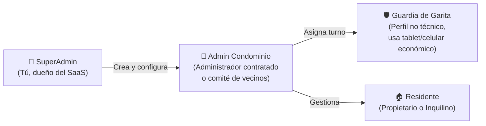
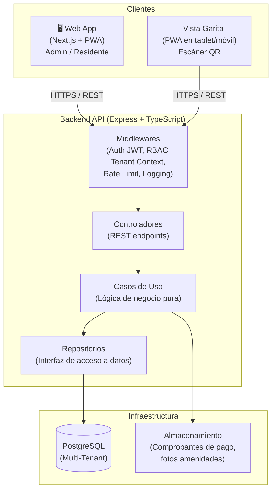
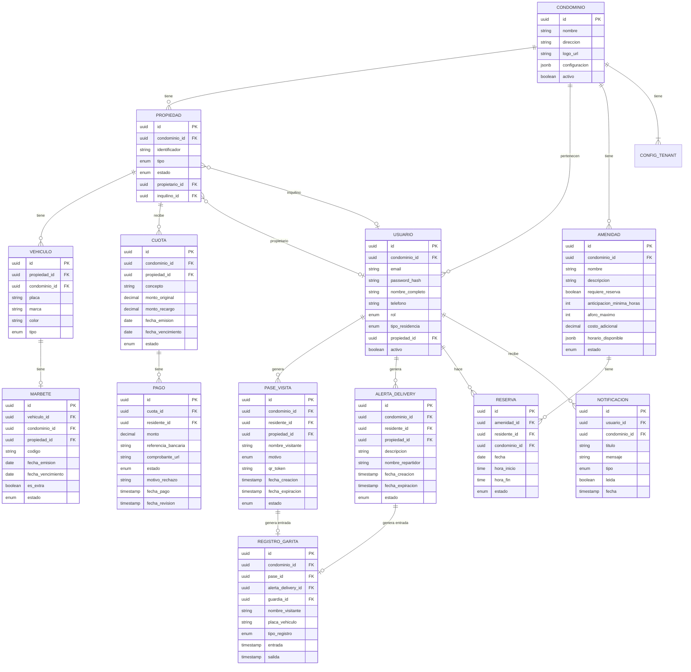

# Nexia — Product Requirements Document (PRD) & Plan de Proyecto

## 1. Visión del Producto

**Nexia** es una plataforma SaaS multi-tenant para la administración integral de condominios y residenciales en Guatemala y Latinoamérica.

Resuelve los **3 dolores críticos** que enfrentan comités de vecinos y administradores:

1. **Descontrol en la garita:** Cuadernos sucios, visitas sin registro, placas sin verificar.
2. **Caos en las finanzas:** Cobros por recibitos de papel, transferencias que se revisan a mano en WhatsApp, morosos sin seguimiento.
3. **Falta de rendición de cuentas:** Residentes que no saben cuánto deben, administradores que no tienen reportes claros, conflictos por reservas de áreas comunes.

### 1.1 Objetivos Estratégicos

| Objetivo | Métrica de Éxito |
| :--- | :--- |
| **Portafolio GitHub de nivel Senior** | Repositorio público con Clean Architecture, Docker, Swagger, tests, README profesional y demo desplegada. |
| **Producto vendible como SaaS** | Al menos 1 condominio piloto usando el sistema en producción. |
| **Demostrar arquitectura escalable** | Multi-tenancy funcional: un solo despliegue sirve a N condominios de forma aislada. |

### 1.2 Qué NO es Nexia (Alcance Negativo)

Para mantener el foco y no caer en *scope creep*:

- ❌ **No es una app de mensajería entre vecinos** (no es un grupo de WhatsApp ni foro). Solo notificaciones transaccionales (pase QR generado, cuota emitida, pago aprobado).
- ❌ **No es un sistema contable completo** (no genera estados financieros NIIF ni reportes fiscales). Maneja cuotas, pagos y balances de saldo.
- ❌ **No es domótica ni IoT** (no controla plumas eléctricas ni cámaras de seguridad de forma directa en el MVP).
- ❌ **No incluye facturación electrónica FEL** en las fases iniciales (se deja como módulo futuro).
- ❌ **No es una app móvil nativa** en esta fase. Es una Progressive Web App (PWA) responsive que funciona en cualquier navegador móvil como si fuera una app instalada.

---

## 2. Usuarios y Roles del Sistema

### 2.1 Personas (User Personas)



### 2.2 Matriz de Permisos (RBAC — Role-Based Access Control)

| Funcionalidad | SuperAdmin | Admin Condominio | Guardia | Residente |
| :--- | :---: | :---: | :---: | :---: |
| Crear/eliminar condominios (tenants) | ✅ | ❌ | ❌ | ❌ |
| Configurar módulos y reglas del condominio | ✅ | ✅ | ❌ | ❌ |
| Ver métricas globales de todos los condominios | ✅ | ❌ | ❌ | ❌ |
| Gestionar propiedades y residentes | ❌ | ✅ | ❌ | ❌ |
| Gestionar marbetes vehiculares | ❌ | ✅ | ❌ | ❌ |
| Emitir cuotas y aprobar/rechazar pagos | ❌ | ✅ | ❌ | ❌ |
| Ver reportes financieros del condominio | ❌ | ✅ | ❌ | ❌ |
| Administrar amenidades | ❌ | ✅ | ❌ | ❌ |
| Escanear QR y registrar entradas/salidas | ❌ | ❌ | ✅ | ❌ |
| Ver deliveries esperados y registrar ingreso | ❌ | ❌ | ✅ | ❌ |
| Consultar teléfono de propiedad y registrar verificación por llamada | ❌ | ❌ | ✅ | ❌ |
| Buscar marbete por código | ❌ | ❌ | ✅ | ❌ |
| Ver bitácora de garita | ❌ | ✅ | ✅ (solo lectura) | ❌ |
| Generar pases QR para visitas | ❌ | ❌ | ❌ | ✅ |
| Crear alertas de delivery (PIN) | ❌ | ❌ | ❌ | ✅ |
| Ver estado de cuenta y subir comprobantes | ❌ | ❌ | ❌ | ✅ |
| Reservar amenidades | ❌ | ❌ | ❌ | ✅ |
| Ver directorio de su propia propiedad | ❌ | ❌ | ❌ | ✅ |

---

## 3. Requerimientos Funcionales (Por Módulo)

### 3.1 Módulo Core: Autenticación, Tenants y Configuración

> [!IMPORTANT]
> Este módulo es la **columna vertebral** de todo el sistema. Cada decisión aquí afecta a todos los demás módulos.

#### RF-AUTH-01: Registro e Inicio de Sesión
- Login con email + contraseña (hash bcrypt, mínimo 12 rounds).
- Flujo de JWT con **Access Token** (vida corta: 15 min) + **Refresh Token** (vida larga: 7 días, almacenado en cookie HTTP-only Secure).
- Endpoint de refresh silencioso para renovar la sesión sin re-login.

#### RF-AUTH-02: Roles y Permisos (RBAC)
- Cada usuario tiene exactamente **un rol por condominio** (un usuario puede ser Residente en el Condominio A y Admin en el Condominio B, pero no ocurriría en el MVP típico).
- Middleware de autorización que valida rol + tenant en cada petición.

#### RF-TENANT-01: Gestión de Condominios (Tenants)
- **SuperAdmin** puede crear un nuevo condominio proporcionando: nombre, dirección, logo (opcional), y datos del administrador principal.
- Al crear el tenant, se genera automáticamente la configuración por defecto.

#### RF-TENANT-02: Configuración Dinámica por Tenant
- Cada condominio tiene un objeto de configuración almacenado en BD que incluye:
  - **Módulos activos:** `garita_qr`, `finanzas`, `amenidades`, `marbetes` (booleanos on/off).
  - **Políticas de negocio:**
    - `dia_corte_cuota` (1-28)
    - `monto_cuota_base` (en Quetzales)
    - `recargo_mora_porcentaje` (ej. 10%)
    - `meses_para_moroso` (ej. 2)
    - `bloquear_visitas_morosos` (true/false)
    - `vigencia_pase_qr_horas` (ej. 8)
    - `vigencia_alerta_delivery_horas` (ej. 2)
    - `moneda` (GTQ por defecto)
  - **Políticas de marbetes** (solo aplican si `marbetes: true`):
    - `marbetes_incluidos_por_propiedad` (ej. 2 — cuántos marbetes vienen incluidos en la cuota mensual)
    - `costo_marbete_extra` (ej. Q50 — cuánto cuesta cada marbete adicional)
    - `periodo_marbete` (`MENSUAL` | `ANUAL` — cada cuánto se renueva)
- El Admin Condominio puede modificar estas políticas desde su panel.

---

### 3.2 Módulo de Propiedades y Residentes

#### RF-PROP-01: Registro de Propiedades
- Cada propiedad (casa, apartamento, lote) pertenece a un condominio y tiene:
  - Identificador único dentro del condominio (ej. "Casa A-12", "Apto 5B").
  - Tipo: `CASA`, `APARTAMENTO`, `LOTE`, `LOCAL_COMERCIAL`.
  - Estado: `OCUPADA`, `DESOCUPADA`, `EN_CONSTRUCCION`.
  - Área en m² (opcional).

#### RF-PROP-02: Asignación de Propietarios e Inquilinos
- Una propiedad tiene **un propietario** (persona con título legal) y opcionalmente **un inquilino** (quien habita).
- Ambos son usuarios del sistema con rol `RESIDENTE`, pero se diferencia internamente como `tipo_residencia: PROPIETARIO | INQUILINO`.
- El propietario puede existir sin habitar (vive fuera, tiene su casa rentada).
- Historial de cambio de propietarios/inquilinos (auditoría).
- **Datos obligatorios del residente:** nombre completo, teléfono de contacto, email.
- **Datos adicionales configurables por tenant:** Cada condominio es diferente — algunos piden DPI (Documento Personal de Identificación), NIT, número de escritura, contacto de emergencia, etc. El Admin Condominio define qué campos adicionales son requeridos para su residencial desde la configuración del tenant. Estos campos se almacenan como datos dinámicos (`jsonb`) asociados al usuario.

#### RF-PROP-03: Registro de Vehículos
- Cada propiedad puede registrar N vehículos autorizados con:
  - Placa, marca, color, modelo (año), tipo (`SEDAN`, `PICKUP`, `MOTO`).
- El guardia puede buscar por placa para verificar si un vehículo está autorizado.

#### RF-PROP-04: Marbetes Vehiculares (Configurable por Tenant)
> [!NOTE]
> Esta funcionalidad **solo se activa** si el condominio tiene `marbetes: true` en su configuración. Muchos residenciales en Guatemala usan marbetes (calcomanías/stickers) que pegan en el parabrisas para identificar rápidamente los vehículos autorizados y vigentes.

- **Emisión de marbetes:**
  - Al registrar un vehículo, si el módulo está activo, se le asigna un marbete con un **código único** (ej. `MRB-2026-0045`).
  - Cada propiedad tiene derecho a N marbetes incluidos sin costo extra (según `marbetes_incluidos_por_propiedad`, ej. 2).
  - Si la propiedad tiene más vehículos que los incluidos, cada marbete adicional genera un cargo automático por `costo_marbete_extra` (ej. Q50).
  
- **Vigencia y renovación:**
  - Cada marbete tiene un período de vigencia según `periodo_marbete` (`MENSUAL` o `ANUAL`).
  - El sistema controla la fecha de vencimiento. Un marbete vencido cambia su estado a `VENCIDO`.
  - En el caso mensual, el marbete se renueva automáticamente al registrarse el pago de la cuota del mes.
  
- **Estados del marbete:** `ACTIVO`, `VENCIDO`, `CANCELADO`.

- **Integración con garita:**
  - El guardia puede buscar un código de marbete y verificar si está vigente.
  - Si el marbete está `VENCIDO` (propiedad en mora), se muestra alerta al guardia.

- **Integración con finanzas:**
  - Los marbetes extra se reflejan como un cargo adicional en la cuota de la propiedad.

---

### 3.3 Módulo de Seguridad y Garita (QR)

> [!IMPORTANT]
> Este módulo es el **"efecto wow"** que vende el producto. La experiencia del guardia debe ser extremadamente simple: pantalla grande, botones grandes, cero distracciones.

#### RF-GAR-01: Generación de Pases QR por el Residente
- El residente crea un pase de visita con:
  - Nombre completo del visitante.
  - Motivo (selección: `VISITA_PERSONAL`, `SERVICIO_TECNICO`, `EVENTO`).
  - Fecha y hora estimada de llegada.
  - Vigencia automática según configuración del tenant (`vigencia_pase_qr_horas`).
- El sistema genera un código QR único (UUID + firma HMAC para evitar falsificación).
- El residente puede compartir el QR como imagen o link por WhatsApp/mensajería.

> [!NOTE]
> **¿Por qué `DELIVERY` no usa QR?** En la práctica, un residente no puede compartirle un código QR a un repartidor de Uber Eats, PedidosYa o un mensajero. El repartidor llega en minutos y no tiene tiempo de abrir un link. Para estos casos existe el sistema de **Alerta de Delivery** (RF-GAR-06).

#### RF-GAR-02: Portal de Garita (Escáner QR)
- Interfaz dedicada para el guardia (ruta separada tipo `/garita`).
- Diseño: fondo oscuro, botón grande central "ESCANEAR", resultado inmediato.
- Usa la cámara del dispositivo para leer el QR.
- **Resultado VERDE (Válido):**
  - Muestra: nombre del visitante, casa destino, residente anfitrión, motivo, hora de autorización.
  - Botón: "Registrar Entrada".
- **Resultado ROJO (Inválido):**
  - QR expirado, ya utilizado, o no reconocido.
  - Mensaje claro del motivo de rechazo.
- **Resultado AMARILLO (Alerta):**
  - QR válido pero la casa anfitriona tiene mora grave (si `bloquear_visitas_morosos` está activo).
  - Muestra: "Residente con suspensión de privilegios. Contacte a Administración."

#### RF-GAR-03: Registro Manual de Visitas (Sin QR)
- Para visitantes inesperados, el guardia puede hacer un registro manual ingresando:
  - Nombre, placa (si aplica), casa destino, motivo.
  - Esto NO genera QR, pero sí queda en la bitácora.

#### RF-GAR-04: Bitácora Digital de Entradas/Salidas
- Registro cronológico de todos los ingresos (con QR o manuales) y salidas.
- Campos: fecha/hora entrada, fecha/hora salida, visitante, placa, casa destino, guardia que registró.
- Filtrable por fecha, casa o nombre de visitante.
- Exportable a Excel/CSV por el Admin Condominio.

#### RF-GAR-05: Consulta de Placas Autorizadas
- El guardia puede buscar una placa y ver si corresponde a un vehículo registrado del condominio.
- Si no está registrada, se marca como "Vehículo no identificado" en la bitácora.

#### RF-GAR-06: Alerta de Delivery
> [!IMPORTANT]
> Un residente **no puede compartirle un QR ni un código** a un repartidor de Uber Eats, PedidosYa, MotoExpress o Amazon. El repartidor llega en minutos, no tiene tiempo y no va a abrir links ni anotar códigos. La solución es la más simple y práctica: **el residente avisa al guardia desde la app, el guardia lo ve y deja pasar**.

- **Flujo del Residente:**
  1. El residente toca **"Espero un delivery"** desde su app.
  2. Ingresa: descripción breve (ej. "Pedido de Uber Eats", "Paquete de Amazon"), nombre del repartidor (opcional).
  3. La alerta aparece **instantáneamente** en el panel del guardia.
  4. La alerta tiene una vigencia automática (configurable, por defecto 2 horas) y luego se desactiva sola.

- **Flujo del Guardia:**
  1. En la pantalla de garita aparece una sección **"Deliveries Esperados"** con las alertas activas: casa destino, descripción del pedido, nombre del residente que autorizó, y hora de creación.
  2. Cuando llega el repartidor y dice a qué casa va, el guardia verifica que existe una alerta activa para esa casa.
  3. Un toque en **"Registrar Delivery"** y el repartidor pasa. Queda registrado en la bitácora con tipo `DELIVERY`.
  4. Si NO hay alerta activa para esa casa, el guardia utiliza el **fallback de llamada a la residencia** (RF-GAR-07).

- **Seguridad:**
  - La alerta expira automáticamente según `vigencia_alerta_delivery_horas`.
  - Un residente moroso con `bloquear_visitas_morosos: true` no puede crear alertas de delivery.
  - Todo delivery registrado queda en la bitácora con: guardia que autorizó, casa destino, descripción y timestamp.

#### RF-GAR-07: Fallback Universal — Contacto Directo con la Residencia
> [!IMPORTANT]
> Este mecanismo es el **último recurso** para CUALQUIER situación no prevista por el sistema. Es lo que los guardias hacen hoy en la mayoría de condominios (llamar a la casa), pero digitalizado: el sistema le facilita al guardia el número de teléfono y **deja constancia de que se realizó la verificación**.

- **Casos de uso:**
  - Llega un delivery sin alerta activa.
  - Llega una visita sin pase QR y el residente no tiene internet para generarlo.
  - El sistema está caído o el guardia tiene problemas con el escáner.
  - Cualquier situación ambigua donde el guardia necesita confirmar con el residente.

- **Flujo:**
  1. El guardia selecciona la casa destino en su panel (búsqueda por identificador, ej. "A-12").
  2. El sistema muestra el **número de teléfono registrado** del propietario/inquilino (sin necesidad de buscar en un directorio físico).
  3. El guardia llama por teléfono al residente para confirmar.
  4. El guardia registra el ingreso como **"Verificación por llamada"** con: nombre del visitante, motivo, placa (opcional).
  5. Todo queda en la bitácora con tipo `VERIFICACION_LLAMADA`.

- **Diseño en la UI del guardia:** Botón visible **"Verificar con Residente"** siempre disponible, al lado de "Escanear QR" y "Deliveries Esperados".

---

### 3.4 Módulo Financiero (Cuotas, Pagos y Morosidad)

#### RF-FIN-01: Emisión de Cuotas
- El Admin puede generar cuotas de dos formas:
  - **Masiva automática:** Genera la cuota del mes para TODAS las propiedades activas con un clic, usando el `monto_cuota_base` de la configuración.
  - **Individual:** Para cargos extras (multas, cuota extraordinaria de asamblea, reparación).
- Cada cuota tiene: propiedad destino, concepto, monto, fecha de emisión, fecha de vencimiento, estado (`PENDIENTE`, `PAGADA`, `VENCIDA`, `PARCIAL`).

#### RF-FIN-02: Recargo por Mora Automático
- Si `fecha_actual > fecha_vencimiento` y la cuota sigue `PENDIENTE`:
  - Se aplica el `recargo_mora_porcentaje` configurado.
  - El recargo se recalcula cada período (configurable: mensual).

#### RF-FIN-03: Carga de Comprobantes de Pago por el Residente
- El residente selecciona la(s) cuota(s) que desea pagar.
- Sube una imagen del comprobante bancario (Banrural, BI, BAC, G&T, etc.).
- Ingresa: número de referencia de la transferencia, monto pagado, fecha de la transacción.
- Estado del pago: `PENDIENTE_REVISION`.

#### RF-FIN-04: Conciliación de Pagos por el Admin
- Panel con lista de pagos `PENDIENTE_REVISION`.
- Para cada comprobante, el Admin puede:
  - **Aprobar:** El pago se marca como `APROBADO`, la cuota cambia a `PAGADA`.
  - **Rechazar:** Se indica el motivo (monto incorrecto, comprobante ilegible, duplicado). El residente recibe notificación.

#### RF-FIN-05: Estado de Cuenta del Residente
- El residente ve su historial de cuotas (emitidas, pagadas, pendientes, vencidas).
- Balance total: cuánto debe hasta la fecha.
- Puede descargar un recibo en PDF de cualquier pago aprobado.

#### RF-FIN-06: Semáforo de Morosidad (Dashboard del Admin)
- Vista de todas las propiedades con indicador visual:
  - 🟢 **Al día:** No tiene cuotas vencidas.
  - 🟡 **1 mes vencido:** Alerta temprana.
  - 🔴 **2+ meses vencidos (Moroso):** Según `meses_para_moroso` configurado.
- Filtros: por estado de morosidad, por sector/manzana, por monto adeudado.

#### RF-FIN-07: Reportes Financieros
- Reporte mensual: ingresos del mes, cuotas cobradas vs emitidas, tasa de morosidad.
- Exportable en PDF y Excel.

---

### 3.5 Módulo de Amenidades y Reservas

#### RF-AME-01: Catálogo Dinámico de Amenidades
- El Admin crea/edita amenidades (áreas comunes) desde su panel:
  - Nombre, descripción, foto (opcional).
  - `requiere_reserva: boolean` — si es `false`, solo aparece como info (ej. "Parque infantil").
  - `anticipacion_minima_horas` — con cuántas horas de anticipación se debe reservar.
  - `aforo_maximo` — (opcional) cantidad de personas.
  - `costo_adicional` — (opcional, ej. Q150 por evento en la Casa Club).
  - `horario_disponible` — horarios en que se puede reservar (ej. 8:00 a 22:00).
  - `estado: ACTIVA | EN_MANTENIMIENTO | DESHABILITADA`.

#### RF-AME-02: Reserva por el Residente
- El residente ve solo las amenidades de su condominio que estén `ACTIVA` y `requiere_reserva: true`.
- Selecciona fecha, hora inicio y hora fin.
- El sistema valida:
  - No hay solapamiento con otra reserva existente (control de concurrencia).
  - El residente está solvente (no moroso, según configuración del tenant).
  - Se respeta la anticipación mínima.
- Si aplica costo adicional, se le informa antes de confirmar.

#### RF-AME-03: Calendario de Reservas
- Vista de calendario (por día/semana/mes) para que el Admin y los residentes vean qué está reservado y qué está disponible.

---

### 3.6 Módulo de Notificaciones

> [!NOTE]
> En el MVP, las notificaciones se implementan de forma **in-app** (dentro de la plataforma). La integración con WhatsApp API o email SMTP se deja como mejora post-MVP.

#### RF-NOT-01: Notificaciones In-App
- El sistema genera notificaciones internas para eventos clave:
  - **Para el Residente:** "Tu cuota de Julio ha sido emitida", "Tu pago fue aprobado", "Tu pago fue rechazado: motivo X", "Tienes una cuota vencida".
  - **Para el Admin:** "Nuevo comprobante de pago pendiente de revisión", "Nueva reserva de amenidad".
  - **Para el Guardia:** (Ninguna en el MVP; su interfaz es reactiva al escaneo).
- Ícono de campana con badge de no leídas.
- Marcar como leída individual o masivamente.

---

## 4. Requerimientos No Funcionales

### 4.1 Rendimiento
| Métrica | Objetivo |
| :--- | :--- |
| Tiempo de respuesta API (p95) | < 300ms para endpoints comunes |
| Validación de QR en garita | < 1 segundo desde escaneo hasta resultado visual |
| Carga del dashboard | < 2 segundos en conexión 3G |

### 4.2 Seguridad
- **Autenticación:** JWT con Access + Refresh Tokens. Refresh en cookie HTTP-only Secure SameSite=Strict.
- **Autorización:** Middleware RBAC que verifica rol + tenant_id en cada request.
- **Aislamiento de datos:** Ningún endpoint devuelve datos fuera del tenant del usuario autenticado. Queries filtradas siempre por `condominio_id`.
- **Validación de entradas:** Toda entrada del usuario validada con Zod antes de procesarse.
- **Rate Limiting:** Protección contra brute-force en login y endpoints públicos.
- **CORS:** Configurado estrictamente para los dominios del frontend.
- **Sanitización:** Prevención de XSS y SQL Injection (Prisma ya previene SQLi por diseño).

### 4.3 Escalabilidad
- **Multi-Tenancy por discriminador:** Columna `condominio_id` en tablas principales con índices compuestos.
- **Stateless Backend:** El servidor no guarda estado de sesión en memoria. Escala horizontalmente con múltiples instancias.
- **Conexión a BD con pool:** Prisma connection pool configurado.

### 4.4 Observabilidad
- **Logging estructurado:** Logger con niveles (info, warn, error) y contexto (tenant_id, user_id, request_id).
- **Health Check endpoint:** `GET /health` que verifica conexión a BD.
- **Manejo de errores centralizado:** Middleware global de errores con respuestas consistentes y códigos HTTP correctos.

### 4.5 Calidad de Código
- **Linting:** ESLint + Prettier configurados con reglas estrictas.
- **Testing:** Tests unitarios para casos de uso críticos (emisión de cuotas, validación de QR, control de concurrencia en reservas).
- **Commits:** Conventional Commits (`feat:`, `fix:`, `docs:`, `refactor:`).

---

## 5. Stack Tecnológico Definitivo

| Capa | Tecnología | Versión Objetivo |
| :--- | :--- | :--- |
| **Runtime** | Node.js | LTS (v20+) |
| **Lenguaje** | TypeScript | 5.x (strict mode) |
| **Backend Framework** | Express.js | 4.x |
| **ORM** | Prisma | 6.x |
| **Base de Datos** | PostgreSQL | 16+ |
| **Validación** | Zod | 3.x |
| **Auth** | jsonwebtoken + bcryptjs | — |
| **Documentación API** | Swagger (swagger-jsdoc + swagger-ui-express) | — |
| **Frontend Framework** | Next.js (App Router) | 15.x |
| **Estilos** | Tailwind CSS | 4.x |
| **Componentes UI** | shadcn/ui + Radix UI | — |
| **Íconos** | Lucide React | — |
| **HTTP Client (Front)** | Axios o fetch nativo tipado | — |
| **Generación QR** | qrcode (backend) + html5-qrcode (escáner frontend) | — |
| **PDF** | @react-pdf/renderer o jsPDF | — |
| **Contenedores** | Docker + Docker Compose | — |
| **Monorepo** | npm workspaces | — |
| **Despliegue Backend** | Render o Railway | Free/Starter tier |
| **Despliegue Frontend** | Vercel | Free tier |
| **Despliegue BD** | Supabase PostgreSQL o Render PostgreSQL | Free tier |

---

## 6. Arquitectura del Sistema

### 6.1 Diagrama de Alto Nivel



### 6.2 Arquitectura Interna del Backend (Clean Architecture)

```
apps/api/src/
├── domain/                     # CAPA DE DOMINIO (Cero dependencias externas)
│   ├── entities/               # Entidades puras: User, Property, Fee, Payment, Visit, Amenity
│   ├── enums/                  # Enums: Roles, FeeStatus, PaymentStatus, VisitStatus
│   ├── errors/                 # Errores de dominio personalizados (NotFoundError, ForbiddenError)
│   └── interfaces/             # Contratos/Interfaces de Repositorios (IUserRepository, IFeeRepository)
│
├── application/                # CAPA DE APLICACIÓN (Casos de Uso / Servicios)
│   ├── use-cases/
│   │   ├── auth/               # LoginUseCase, RefreshTokenUseCase
│   │   ├── tenants/            # CreateTenantUseCase, UpdateTenantConfigUseCase
│   │   ├── properties/         # CreatePropertyUseCase, AssignResidentUseCase
│   │   ├── gate/               # GenerateVisitPassUseCase, ValidateQRUseCase, RegisterEntryUseCase
│   │   ├── finances/           # EmitFeesUseCase, SubmitPaymentUseCase, ApprovePaymentUseCase
│   │   ├── amenities/          # CreateAmenityUseCase, BookAmenityUseCase
│   │   └── notifications/      # CreateNotificationUseCase, GetUnreadNotificationsUseCase
│   └── dtos/                   # Data Transfer Objects (entrada/salida de cada use case)
│
├── infrastructure/             # CAPA DE INFRAESTRUCTURA (Implementaciones concretas)
│   ├── database/
│   │   └── prisma/             # Implementaciones de los repositorios usando Prisma
│   ├── auth/                   # Implementación JWT (generación, verificación de tokens)
│   ├── storage/                # Subida de archivos (local en dev, S3/Cloudinary en prod)
│   ├── qr/                     # Generación y verificación de códigos QR
│   └── pdf/                    # Generación de recibos y reportes en PDF
│
├── presentation/               # CAPA DE PRESENTACIÓN (Express HTTP)
│   ├── routes/                 # Definición de rutas agrupadas por módulo
│   ├── controllers/            # Controladores que invocan los Casos de Uso
│   ├── middlewares/            # authMiddleware, rbacMiddleware, tenantMiddleware, errorHandler
│   └── validators/             # Esquemas Zod para validar body/params/query de cada ruta
│
├── config/                     # Variables de entorno, constantes, configuración de la app
└── server.ts                   # Entry point: Express app setup
```

### 6.3 Estructura del Monorepo

```
Nexia/
├── apps/
│   ├── api/                    # Backend (Node.js + Express + TypeScript + Prisma)
│   │   ├── src/                # Estructura Clean Architecture (descrita arriba)
│   │   ├── prisma/
│   │   │   ├── schema.prisma   # Modelo de datos
│   │   │   └── migrations/     # Migraciones de Prisma
│   │   ├── tests/              # Tests unitarios e integración
│   │   ├── Dockerfile
│   │   ├── tsconfig.json
│   │   └── package.json
│   │
│   └── web/                    # Frontend (Next.js App Router + Tailwind + shadcn/ui)
│       ├── src/
│       │   ├── app/
│       │   │   ├── (auth)/             # /login, /forgot-password
│       │   │   ├── (superadmin)/       # /sa/condominios, /sa/metricas
│       │   │   ├── (dashboard)/        # /dashboard (Admin Condominio)
│       │   │   │   ├── propiedades/
│       │   │   │   ├── residentes/
│       │   │   │   ├── finanzas/
│       │   │   │   ├── amenidades/
│       │   │   │   ├── garita/         # Config de garita (para Admin)
│       │   │   │   └── configuracion/
│       │   │   ├── (residente)/        # /mi-cuenta, /mis-cuotas, /mis-visitas, /reservas
│       │   │   └── (garita)/           # /garita/escanear (Vista dedicada para Guardia)
│       │   ├── components/
│       │   │   ├── ui/                 # shadcn/ui components
│       │   │   ├── layout/             # Sidebar, Navbar, etc.
│       │   │   └── modules/            # Componentes por módulo (QRScanner, FeeTable, etc.)
│       │   ├── hooks/                  # Custom hooks (useAuth, useTenant, useNotifications)
│       │   ├── lib/                    # API client tipado, utilidades
│       │   └── stores/                 # Estado global (Zustand o Context)
│       ├── public/
│       ├── Dockerfile
│       ├── tailwind.config.ts
│       ├── tsconfig.json
│       └── package.json
│
├── packages/
│   └── shared-types/           # Tipos TypeScript compartidos (DTOs, Enums, Interfaces)
│       ├── src/
│       │   ├── user.ts
│       │   ├── property.ts
│       │   ├── fee.ts
│       │   ├── payment.ts
│       │   ├── visit.ts
│       │   ├── amenity.ts
│       │   ├── tenant.ts
│       │   └── index.ts
│       ├── tsconfig.json
│       └── package.json
│
├── docker/
│   └── docker-compose.yml      # PostgreSQL + API para desarrollo local
│
├── docs/
│   ├── architecture.md         # Diagramas de arquitectura (Mermaid)
│   ├── api-endpoints.md        # Listado de todos los endpoints REST
│   └── database-erd.md         # Diagrama Entidad-Relación
│
├── .env.example                # Variables de entorno de ejemplo
├── .gitignore
├── .eslintrc.json
├── .prettierrc
├── README.md                   # README profesional con badges, arquitectura, demo link
├── LICENSE
├── turbo.json                  # (Opcional) si usamos Turborepo para builds
└── package.json                # Monorepo root con workspaces
```

---

## 7. Modelo de Datos (Vista Preliminar)

> [!NOTE]
> El diagrama Entidad-Relación completo con todos los campos se diseñará en detalle en la Fase 1 de desarrollo. Esta es la vista de alto nivel de las entidades principales y sus relaciones.



---

## 8. Endpoints API (Vista de Alto Nivel)

> [!NOTE]
> Se documentarán en detalle con Swagger/OpenAPI durante el desarrollo. Esta tabla muestra la estructura general.

### Auth
| Método | Ruta | Descripción |
| :--- | :--- | :--- |
| POST | `/api/auth/login` | Iniciar sesión |
| POST | `/api/auth/refresh` | Renovar access token |
| POST | `/api/auth/logout` | Cerrar sesión (invalidar refresh) |

### Tenants (SuperAdmin)
| Método | Ruta | Descripción |
| :--- | :--- | :--- |
| POST | `/api/tenants` | Crear condominio |
| GET | `/api/tenants` | Listar condominios |
| PATCH | `/api/tenants/:id/config` | Actualizar configuración |

### Propiedades
| Método | Ruta | Descripción |
| :--- | :--- | :--- |
| GET | `/api/properties` | Listar propiedades del condominio |
| POST | `/api/properties` | Crear propiedad |
| PATCH | `/api/properties/:id` | Actualizar propiedad |
| POST | `/api/properties/:id/residents` | Asignar residente |
| GET | `/api/properties/:id/vehicles` | Listar vehículos |
| POST | `/api/properties/:id/vehicles` | Registrar vehículo |

### Marbetes (Configurable por Tenant)
| Método | Ruta | Descripción |
| :--- | :--- | :--- |
| GET | `/api/properties/:id/marbetes` | Listar marbetes de una propiedad |
| POST | `/api/vehicles/:id/marbetes` | Emitir marbete para un vehículo |
| PATCH | `/api/marbetes/:id/cancel` | Cancelar marbete |
| GET | `/api/gate/search-marbete/:code` | Buscar marbete por código (guardia) |

### Garita y Visitas
| Método | Ruta | Descripción |
| :--- | :--- | :--- |
| POST | `/api/visits` | Generar pase QR |
| GET | `/api/visits/my` | Mis pases (residente) |
| POST | `/api/gate/validate-qr` | Validar QR escaneado |
| POST | `/api/gate/manual-entry` | Registro manual (guardia) |
| POST | `/api/gate/register-exit/:id` | Registrar salida |
| GET | `/api/gate/log` | Bitácora de garita |
| GET | `/api/gate/search-plate/:plate` | Buscar placa |

### Alertas de Delivery
| Método | Ruta | Descripción |
| :--- | :--- | :--- |
| POST | `/api/deliveries` | Crear alerta de delivery (residente) |
| GET | `/api/deliveries/my` | Mis alertas activas (residente) |
| DELETE | `/api/deliveries/:id` | Cancelar alerta (residente) |
| GET | `/api/gate/deliveries/active` | Deliveries esperados activos (guardia) |
| POST | `/api/gate/deliveries/:id/register` | Registrar ingreso de delivery (guardia) |

### Fallback — Contacto con Residencia
| Método | Ruta | Descripción |
| :--- | :--- | :--- |
| GET | `/api/gate/contact/:propertyId` | Obtener teléfono de contacto de la propiedad (guardia) |
| POST | `/api/gate/call-verification` | Registrar ingreso por verificación telefónica (guardia) |

### Finanzas
| Método | Ruta | Descripción |
| :--- | :--- | :--- |
| POST | `/api/fees/bulk-emit` | Emisión masiva de cuotas |
| POST | `/api/fees` | Emitir cuota individual |
| GET | `/api/fees` | Listar cuotas (admin) |
| GET | `/api/fees/my-account` | Estado de cuenta (residente) |
| POST | `/api/payments` | Subir comprobante de pago |
| GET | `/api/payments/pending` | Pagos pendientes de revisión |
| PATCH | `/api/payments/:id/approve` | Aprobar pago |
| PATCH | `/api/payments/:id/reject` | Rechazar pago |
| GET | `/api/fees/:id/receipt` | Descargar recibo PDF |
| GET | `/api/reports/monthly` | Reporte financiero mensual |

### Amenidades
| Método | Ruta | Descripción |
| :--- | :--- | :--- |
| GET | `/api/amenities` | Listar amenidades del condominio |
| POST | `/api/amenities` | Crear amenidad (admin) |
| PATCH | `/api/amenities/:id` | Actualizar amenidad |
| GET | `/api/bookings` | Ver reservas (calendario) |
| POST | `/api/bookings` | Crear reserva |
| DELETE | `/api/bookings/:id` | Cancelar reserva |

### Notificaciones
| Método | Ruta | Descripción |
| :--- | :--- | :--- |
| GET | `/api/notifications` | Listar mis notificaciones |
| PATCH | `/api/notifications/:id/read` | Marcar como leída |
| PATCH | `/api/notifications/read-all` | Marcar todas como leídas |

---

## 9. Fases de Desarrollo (Roadmap)

> [!IMPORTANT]
> Cada fase tiene un **entregable funcional y demostrable**. No avanzamos a la siguiente fase hasta que la actual esté completa, probada y con commits limpios.

### Fase 0 — Infraestructura y Scaffolding (Cimientos)
**Duración estimada:** 2-3 días
**Entregable:** Monorepo funcional que compila, se levanta con Docker y tiene un endpoint de health check.

- [ ] Inicializar repositorio Git con `.gitignore`, `LICENSE`, `README.md` inicial.
- [ ] Configurar Monorepo con npm workspaces (`apps/api`, `apps/web`, `packages/shared-types`).
- [ ] Configurar TypeScript estricto en los 3 paquetes.
- [ ] Configurar ESLint + Prettier con reglas compartidas.
- [ ] Configurar Express con estructura Clean Architecture (carpetas vacías con `index.ts`).
- [ ] Configurar Prisma con PostgreSQL (schema inicial con modelo `Condominio`).
- [ ] Crear `docker-compose.yml` que levante PostgreSQL 16.
- [ ] Implementar endpoint `GET /health` que verifica conexión a BD.
- [ ] Configurar variables de entorno con `.env.example`.
- [ ] Configurar Next.js con Tailwind CSS y shadcn/ui (página de landing placeholder).
- [ ] Verificar: `docker compose up` levanta BD + API funcional.

---

### Fase 1 — Autenticación, Tenants y Modelo Base
**Duración estimada:** 4-5 días
**Entregable:** Sistema de login funcional con JWT, creación de tenants por SuperAdmin, y modelo de datos base migrado.

- [ ] Diseñar y migrar el schema Prisma completo (todas las tablas del ERD).
- [ ] Implementar hashing de passwords (bcrypt).
- [ ] Implementar generación y verificación de JWT (access + refresh tokens).
- [ ] Implementar middlewares: `authMiddleware`, `tenantMiddleware`, `rbacMiddleware`.
- [ ] Implementar middleware global de manejo de errores.
- [ ] Implementar `LoginUseCase` y `RefreshTokenUseCase`.
- [ ] Implementar CRUD de Tenants (SuperAdmin): crear, listar, actualizar config.
- [ ] Crear seed de datos de prueba (1 condominio, 1 admin, 2 residentes, 1 guardia).
- [ ] Frontend: Página de Login funcional conectada al API.
- [ ] Frontend: Layout base con Sidebar (varía según rol del usuario autenticado).
- [ ] Tests unitarios: Login, validación de JWT, middleware de tenant.

---

### Fase 2 — Propiedades, Residentes, Vehículos y Marbetes
**Duración estimada:** 4-5 días
**Entregable:** El Admin puede gestionar propiedades, asignar residentes, registrar vehículos y (si el módulo está activo) administrar marbetes.

- [ ] Implementar casos de uso de Propiedades (CRUD).
- [ ] Implementar asignación de Propietario e Inquilino a una Propiedad.
- [ ] Implementar CRUD de Vehículos por Propiedad.
- [ ] Implementar lógica de Marbetes (emisión, renovación, cancelación) condicionada a config del tenant.
- [ ] Implementar validación de marbetes incluidos vs extras con generación de cargo automático.
- [ ] Frontend: Dashboard del Admin con vista de Propiedades (tabla con filtros y búsqueda).
- [ ] Frontend: Modal/formulario para crear/editar propiedad y asignar residente.
- [ ] Frontend: Sección de vehículos y marbetes dentro del detalle de propiedad.
- [ ] Validaciones Zod para todos los endpoints de esta fase.
- [ ] Tests: Emisión de marbetes, límite de incluidos, cargo por extras.

---

### Fase 3 — Módulo de Garita, Pases QR, Alertas de Delivery y Fallback
**Duración estimada:** 6-7 días
**Entregable:** El residente genera pases QR y alertas de delivery, el guardia los valida, y tiene un fallback de llamada para cualquier situación imprevista. Toda actividad queda en la bitácora.

- [ ] Implementar `GenerateVisitPassUseCase` (genera token UUID + firma HMAC + QR).
- [ ] Implementar `ValidateQRUseCase` (verifica firma, vigencia, estado de morosidad del anfitrión).
- [ ] Implementar `RegisterEntryUseCase` y `RegisterExitUseCase`.
- [ ] Implementar `ManualEntryUseCase` (registro sin QR).
- [ ] Implementar `CreateDeliveryAlertUseCase` (crea alerta que aparece en el panel del guardia, con vigencia configurable).
- [ ] Implementar listado de alertas de delivery activas para el guardia.
- [ ] Implementar `RegisterDeliveryUseCase` (guardia registra ingreso de delivery desde la alerta).
- [ ] Implementar `GetPropertyContactUseCase` (guardia consulta teléfono de la propiedad).
- [ ] Implementar `RegisterCallVerificationUseCase` (guardia registra ingreso verificado por llamada telefónica).
- [ ] Implementar consulta de placas autorizadas y código de marbete.
- [ ] Implementar bitácora con filtros y exportación CSV (incluye tipos `DELIVERY` y `VERIFICACION_LLAMADA`).
- [ ] Frontend (Residente): Pantalla para generar pase QR con formulario simple, ver mis pases activos, compartir QR como imagen.
- [ ] Frontend (Residente): Botón "Espero un delivery" con formulario simple (descripción + repartidor opcional).
- [ ] Frontend (Garita): Vista dedicada con escáner de cámara, resultado visual VERDE/ROJO/AMARILLO, botones grandes para registrar entrada/salida.
- [ ] Frontend (Garita): Sección "Deliveries Esperados" con alertas activas y botón "Registrar Delivery".
- [ ] Frontend (Garita): Botón "Verificar con Residente" que muestra teléfono de la propiedad y permite registrar ingreso por llamada.
- [ ] Frontend (Admin): Vista de bitácora con filtros.
- [ ] Tests: Validación de QR expirado, QR ya usado, QR de moroso, alerta de delivery expirada, registro por llamada.

---

### Fase 4 — Módulo Financiero
**Duración estimada:** 5-7 días
**Entregable:** Ciclo completo de cuotas → pago → conciliación → estado de cuenta.

- [ ] Implementar `EmitFeesUseCase` (individual y masiva).
- [ ] Implementar lógica de recargo automático por mora.
- [ ] Implementar `SubmitPaymentUseCase` (subida de comprobante con imagen).
- [ ] Implementar `ApprovePaymentUseCase` y `RejectPaymentUseCase`.
- [ ] Implementar consulta de estado de cuenta del residente.
- [ ] Implementar semáforo de morosidad (query con joins y aggregations).
- [ ] Implementar generación de recibo PDF.
- [ ] Implementar reporte mensual con exportación PDF/Excel.
- [ ] Frontend (Admin): Panel de emisión de cuotas, panel de conciliación de pagos, semáforo de morosidad, reportes.
- [ ] Frontend (Residente): Mi estado de cuenta, subir comprobante, descargar recibos.
- [ ] Tests: Emisión masiva, cálculo de recargos, concurrencia en pagos.

---

### Fase 5 — Módulo de Amenidades
**Duración estimada:** 3-4 días
**Entregable:** Admin crea amenidades dinámicas, residente reserva con validación de solvencia y anti-solapamiento.

- [ ] Implementar CRUD de Amenidades (admin).
- [ ] Implementar `BookAmenityUseCase` con validaciones (solvencia, solapamiento, anticipación).
- [ ] Implementar calendario de reservas.
- [ ] Frontend (Admin): Gestión de amenidades y vista de calendario.
- [ ] Frontend (Residente): Ver amenidades disponibles, crear reserva, ver mis reservas.
- [ ] Tests: Concurrencia en reservas (dos residentes al mismo tiempo), bloqueo por morosidad.

---

### Fase 6 — Notificaciones, Pulido y Documentación
**Duración estimada:** 3-4 días
**Entregable:** Sistema de notificaciones in-app, Swagger funcional, README de nivel producción.

- [ ] Implementar sistema de notificaciones in-app (CRUD + campana con badge).
- [ ] Disparar notificaciones automáticas en eventos clave (cuota emitida, pago aprobado/rechazado, etc.).
- [ ] Configurar Swagger/OpenAPI con documentación de todos los endpoints.
- [ ] Implementar Rate Limiting en endpoints sensibles.
- [ ] Frontend: Componente de notificaciones (campana + dropdown).
- [ ] Frontend: Modo oscuro / claro.
- [ ] Frontend: Responsive final (mobile-first para vista de garita).
- [ ] README.md profesional: badges, screenshots, diagrama de arquitectura, guía de instalación, link a demo, credenciales demo.

---

### Fase 7 — Despliegue, Demo y Portafolio
**Duración estimada:** 2-3 días
**Entregable:** Aplicación corriendo en internet con datos de demostración.

- [ ] Crear base de datos PostgreSQL en Supabase o Render.
- [ ] Desplegar backend API en Render o Railway.
- [ ] Desplegar frontend en Vercel.
- [ ] Poblar base de datos de producción con datos demo realistas (2 condominios de ejemplo con residentes, cuotas y visitas).
- [ ] Crear credenciales demo públicas (usuario demo para cada rol).
- [ ] Verificar flujo completo end-to-end en producción.
- [ ] Actualizar README con link de la demo en vivo.
- [ ] Publicar en LinkedIn con post describiendo el proyecto y la arquitectura.

---

## 10. Riesgos y Mitigaciones

| Riesgo | Impacto | Mitigación |
| :--- | :--- | :--- |
| **Scope creep** (querer agregar más funciones durante el desarrollo) | Retraso indefinido, proyecto nunca se termina | Este PRD define el alcance exacto. Toda idea nueva se agrega a un backlog "Post-MVP", NO a la fase actual. |
| **Complejidad del frontend** (muchas vistas, muchos roles) | Lentitud en desarrollo | Usar shadcn/ui para no diseñar componentes desde cero. Priorizar funcionalidad sobre diseño pixel-perfect. |
| **Multi-tenancy mal implementada** | Fuga de datos entre condominios | Tests específicos que verifican aislamiento. Middleware de tenant obligatorio en TODAS las rutas. |
| **Almacenamiento de imágenes (comprobantes)** | Complejidad de infraestructura | En el MVP, almacenamiento local con opción de migrar a S3/Cloudinary. |
| **Free tiers de plataformas cloud** | Limitaciones de recursos (RAM, conexiones) | Optimizar queries, usar connection pooling, mantener la BD ligera con datos demo limitados. |

---

## 11. Futuro Post-MVP (Backlog)

Estas funcionalidades NO se incluyen en las 7 fases pero son la evolución natural del producto:

- 📱 **App móvil nativa** (React Native o Flutter) para residentes y guardias.
- 💬 **Integración con WhatsApp Business API** para notificaciones automáticas (recordatorio de cuota, confirmación de visita).
- 📧 **Notificaciones por email** (SMTP con templates HTML).
- 🧾 **Facturación Electrónica FEL** (integración con el SAT de Guatemala).
- 📊 **Dashboard analítico avanzado** con gráficos de tendencia (ingresos mensuales, tasa de morosidad histórica).
- 🔐 **Autenticación con Google / Facebook OAuth**.
- 🏗️ **Módulo de mantenimiento** (solicitudes de reparación de áreas comunes por residentes).
- 📋 **Módulo de asambleas y votaciones digitales**.
- 💳 **Pasarela de pago en línea** (Stripe, PayPal o integración bancaria local).
- 🚗 **Lectora de placas con OCR** para automatizar el registro de vehículos en la garita.

---

## 12. Verificación y Definición de "Terminado" (DoD)

### Tests Automatizados
```bash
# Desde la raíz del monorepo
npm run test              # Tests unitarios de casos de uso
npm run test:integration  # Tests de integración con BD de prueba
npm run lint              # Linting sin errores
npm run type-check        # TypeScript sin errores de tipos
```

### Verificación Manual
- [ ] Flujo completo como **SuperAdmin**: crear condominio, configurar módulos y políticas (incluyendo activar/desactivar marbetes).
- [ ] Flujo completo como **Admin Condominio**: crear propiedades, asignar residentes, emitir cuotas, aprobar pagos, crear amenidades, gestionar marbetes.
- [ ] Flujo completo como **Residente**: login, ver estado de cuenta, subir comprobante, generar pase QR, crear alerta de delivery, reservar amenidad.
- [ ] Flujo completo como **Guardia**: escanear QR válido (verde), QR expirado (rojo), QR de moroso (amarillo), registro manual, ver deliveries esperados, registrar delivery, consultar teléfono de propiedad, registrar ingreso por llamada, buscar marbete.
- [ ] Verificar aislamiento multi-tenant: usuario del Condominio A no puede acceder a datos del Condominio B.
- [ ] Verificar que módulos desactivados (ej. `marbetes: false`) no muestran UI ni endpoints activos para ese tenant.
- [ ] Verificar responsive: vista de garita funcional en pantalla de celular.
- [ ] Verificar `docker compose up` desde cero en máquina limpia.
- [ ] Swagger accesible y funcional con todos los endpoints documentados.

---

## 13. Decisiones Confirmadas

> [!NOTE]
> Estas decisiones fueron resueltas durante la fase de planificación y no deben reabrirse durante el desarrollo salvo causa justificada.

| Pregunta | Decisión |
| :--- | :--- |
| **Nombre comercial** | **Nexia** — confirmado como nombre definitivo para el README, branding y dominio. |
| **Módulos del MVP** | Todos los módulos definidos en este PRD (Auth, Propiedades, Garita/QR, Delivery Alerts, Finanzas, Amenidades, Marbetes, Notificaciones). Sin adiciones ni recortes. |
| **Ritmo de desarrollo** | Flexible: entre 1 y 5 horas por día según disponibilidad. No hay deadline fijo. Calidad sobre velocidad. |
| **Marbetes vehiculares** | Incluidos como módulo configurable por tenant. Basados en la experiencia real del desarrollador con su propio condominio en Guatemala. |
| **Delivery sin QR ni PIN** | Resuelto con sistema de **Alerta directa al guardia**. El residente avisa desde la app, el guardia lo ve en su panel y deja pasar. Sin códigos ni complejidad innecesaria para el repartidor. |
| **Fallback universal** | El guardia puede consultar el teléfono de cualquier propiedad y llamar para verificar. Aplica para CUALQUIER caso no previsto (delivery sin alerta, visita sin QR, sistema caído). Queda registrado en bitácora como `VERIFICACION_LLAMADA`. |
| **Datos de residentes** | Configurables por tenant: cada condominio define qué campos adicionales requiere (DPI, NIT, etc.) además de los obligatorios (nombre, teléfono, email). |
| **Inicio de ejecución** | El desarrollador dará la señal explícita para empezar la Fase 0. No iniciar hasta su confirmación. |

